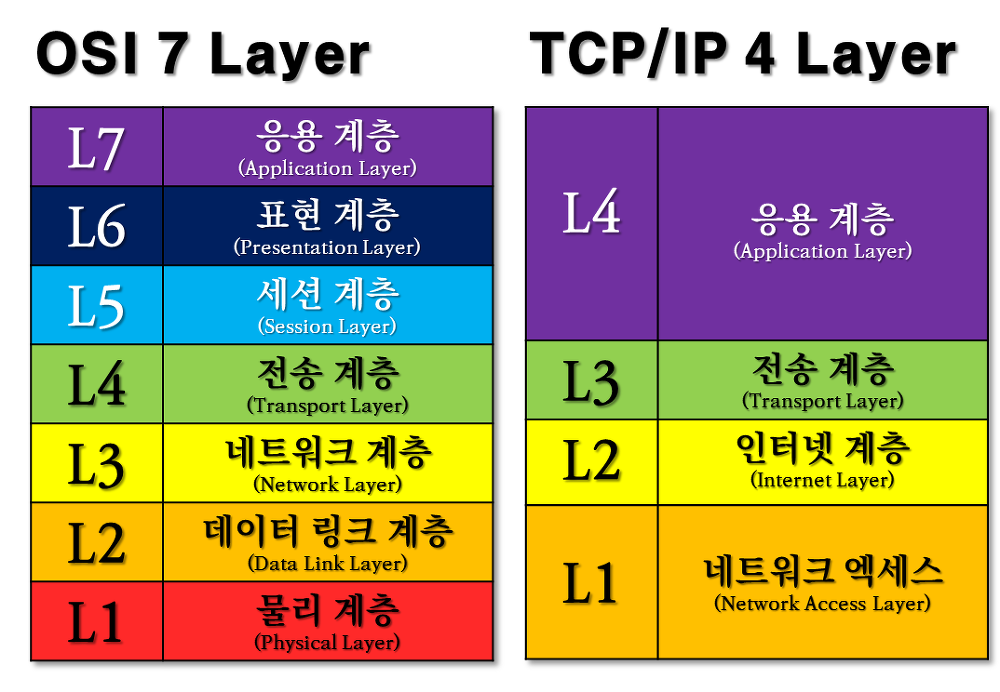

# TCP / IP

- **TCP**: Transmission Control Protocol (전송 담당)
- **IP**: Internet Protocol (주소/라우팅 담당)

---

## 1. TCP/IP란?

- TCP/IP = 인터넷 통신을 위한 프로토콜 집합
    - 특정 프로토콜 2개가 아니라 **인터넷 통신 전체구조** 를 의미
- 서로 다른 컴퓨터들이 데이터를 주고받을 수 있게 해주는 규칙

한 줄 정리  
> 인터넷에서 데이터를 주고받기 위한 표준 통신 규약

---

## 2. TCP/IP 4계층 구조

- Application Layer (응용 계층)
- Transport Layer (전송 계층)
- Internet Layer (인터넷 계층)
- Network Access Layer (네트워크 접근 계층)

---

## 3. 각 계층 설명

### Application Layer (응용 계층)

- 사용자와 직접 상호작용하는 계층
- 데이터 생성 및 요청 처리

**대표 프로토콜**
- HTTP (웹)
- FTP (파일 전송)
- SMTP (메일)

**예시**
- 웹사이트 접속
- 카카오톡 메시지 전송

---

### Transport Layer (전송 계층)

- 데이터 전송 방식 결정
- 신뢰성과 속도 관리

**대표 프로토콜**
- TCP
- UDP

#### ✔ TCP
- 신뢰성 보장
- 데이터 순서 보장
- 오류 검출 및 재전송
- 사용 예: 로그인, 파일 다운로드

#### ✔ UDP
- 빠른 전송
- 신뢰성 낮음
- 순서 보장 없음
- 사용 예: 실시간 스트리밍, 게임

---

### Internet Layer (인터넷 계층)

- 데이터의 IP 주소 지정
- 데이터를 어디로 보낼지 결정
- 목적지까지 경로 설정 (라우팅)

**대표 프로토콜**
- IP (Internet Protocol)

---

### Network Access Layer (네트워크 접근 계층)

- 실제 물리적 데이터 전송 담당
- 전기 신호로 변환하여 전달
- 예: LAN, Wi-Fi

---

## 4. 예시

1. Application Layer
    - 카톡에서 메시지 작성 후 전송
    - (이미 내부적으로 TCP/UDP 선택됨)

2. Transport Layer
    - 선택된 방식으로 처리
    - 채팅 메시지 → TCP 사용 (신뢰성 중요)
    - 음성통화 / 영상통화 → UDP 사용 (속도 중요)

3. Internet Layer
     목적지 IP 주소 설정

4. Network Layer
    - 실제 전기 신호로 변환해서 전송

---
   

## Bonus. API vs Protocol 핵심 정리

| 구분 | API | Protocol |
|------|-----|----------|
| 정의 | 기능을 사용할 수 있게 해주는 인터페이스 | 데이터를 주고받는 통신 규칙 |
| 역할 | "무엇을 할지" 정의 | "어떻게 보낼지" 정의 |
| 목적 | 기능 호출 | 데이터 전달 방식 통일 |
| 관점 | WHAT (무엇을 요청할지) | HOW (어떻게 전달할지) |
| 예시 | REST API (`/game/rooms/{id}`) | HTTP, TCP, IP |

> API는 기능 사용 방법을 정의하고,  
> Protocol은 그 요청을 실제로 전달하는 규칙이다.

