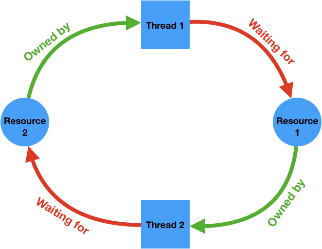
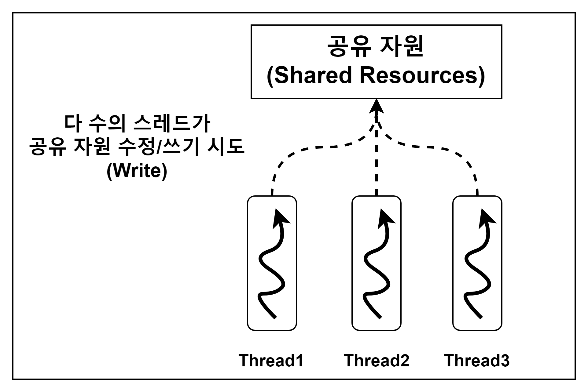

# 데드락과 레이스 컨디션

## 교착 상태 (데드락, Deadlock)

### 정의
- 둘 이상의 프로세스(또는 스레드)가  
  **서로 상대방이 가진 자원을 기다리면서**
  **영원히 진행하지 못하는 상태**

- 이 상태에서는 프로세스가 **Blocked State (대기 상태)** 에 머무르게 되며,  
- 이 상태에서는 프로세스가 **Blocked State(대기 상태)** 에 머무르게 되며,  
  시스템이 멈추거나 비정상적으로 동작할 수 있다.

 

### 예시 상황

- **Thread 1** → Resource 2를 가지고 있음  
- **Thread 2** → Resource 1을 가지고 있음  

#### 그런데...

- Thread 1은 **Resource 1**이 필요해서 요청함  
- Thread 2는 **Resource 2**가 필요해서 요청함  

#### 하지만

- Thread 1은 Resource 2를 놓지 않음  
- Thread 2는 Resource 1을 놓지 않음  

### 결과
- 서로가 서로를 기다리며 아무도 자원을 양보하지 않음으로 둘다 영원히 멈춤 (Blocked State)

 

### 데드락의 4가지 필요 조건 (Coffman Conditions)

데드락은 아래 4가지 조건이 **동시에 만족될 때만** 발생한다.

1. **상호 배제 (Mutual Exclusion)**
   - 자원은 한 번에 하나의 프로세스만 사용할 수 있다.

2. **점유 대기 (Hold and Wait)**
   - 이미 자원을 점유한 상태에서 다른 자원을 기다린다.

3. **비선점 (No Preemption)**
   - 자원을 강제로 빼앗을 수 없다.
   - 자원은 자발적으로 반납되어야 한다.

4. **순환 대기 (Circular Wait)**
   - 프로세스들이 원형 구조로 서로의 자원을 기다린다.
   - (A → B → C → A)

---

### 중요한 포인트

> 이 4가지 중 하나라도 제거하면 데드락은 발생하지 않는다.

  

## 경쟁 상태 (레이스 컨디션, Race Condition)

### 정의
- 둘 이상의 스레드 또는 프로세스가  
  **공유 자원(변수, 메모리 등)** 에 동시에 접근하여 수정할 때 발생하는 문제
- 실행 순서에 따라 결과가 달라지며,  
  **예상하지 못한 값**이 저장될 수 있음

### 예시 상황

#### 상황 가정

- 하나의 공유 변수 `count = 0`
- 두 개의 스레드가 동시에 `count++` 실행

#### 실행 과정 (문제 발생)

1. Thread A가 `count` 값을 읽음 → 0
2. Thread B도 `count` 값을 읽음 → 0
3. Thread A가 `count + 1` 계산 → 1
4. Thread B도 `count + 1` 계산 → 1
5. Thread A가 1 저장
6. Thread B도 1 저장

- 최종 결과: `count = 1`  
- 하지만 기대 결과는 `2`

### 핵심 특징

1. 공유 자원이 존재함
2. 동시에 접근함
3. 실행 순서에 따라 결과가 달라짐
4. 비결정적인 결과가 발생함

  

## 왜 교착 상태(Deadlock) / 경쟁 상태(Race Condition)가 생기나?

### 핵심 이유: **병렬성(Concurrency)과 성능(Performance)을 얻기 위해서**
- CPU는 멀티코어이고, 프로그램은 동시에 여러 일을 처리해야 빠름
- I/O(네트워크/디스크) 대기 시간 동안 CPU가 놀지 않게 하기 위해 멀티스레드/비동기 처리를 사용함
- 또한 DB 커넥션, 캐시, 전역 변수, 파일 같은 **공유 자원**을 함께 쓰면 메모리/시간 효율이 좋아짐

하지만 여러 실행 흐름이 **동시에 공유 자원에 접근**하면  
**동기화가 필요**해지고, 그 과정에서 부작용(side effect)로 문제가 발생한다.

- **경쟁 상태**: 동시에 접근/수정 → 실행 순서에 따라 값이 꼬임(정확성 문제)
- **교착 상태**: 자원을 잠근 채 다른 자원을 기다림 → 서로 기다리며 멈춤(진행 문제)

---

## 해결 방안 요약

### 1) 경쟁 상태(Race Condition) 예방/해결
- **Lock(뮤텍스) / synchronized**로 임계 구역 보호
- **Atomic 연산** 사용(원자적 증가/교환 등)
- **공유 상태 최소화** (지역변수 사용, 상태를 한 곳에서만 변경)
- **불변(Immutable) 데이터** 활용, 함수형 스타일로 상태 변경 줄이기
- (JS의 경우) 전역 상태 공유 최소화 + 상태 변경 순서 관리(큐/단일 업데이트 루프 등)

---

### 2) 교착 상태(Deadlock) 예방/해결
- **락 획득 순서 통일** (모든 스레드가 같은 순서로 자원 잠금) ✅ 실무에서 가장 흔함
- **타임아웃 / tryLock** 사용 (일정 시간 내 획득 실패 시 포기/재시도)
- **Hold-and-Wait 제거** (필요한 자원을 한 번에 요청하거나, 못 얻으면 모두 반납)
- **자원 선점(Preemption)** 가능하게 설계 (필요시 락을 강제로 회수/롤백)
- **데드락 탐지 후 복구** (탐지 → 프로세스/스레드 종료, 롤백 등)

---

### 한 줄 요약
> 병렬성과 성능을 얻기 위해 공유 자원과 동기화를 쓰는데, 그 부작용으로 경쟁 상태(값 꼬임)와 교착 상태(멈춤)가 발생할 수 있다.

  

## 참고자료
- https://hmk1022.tistory.com/entry/%EA%B2%BD%EC%9F%81%EC%83%81%ED%83%9CRace-Condition%EC%99%80-%EB%8D%B0%EB%93%9C%EB%9D%BD#:~:text=%EB%94%B0%EB%9D%BC%EC%84%9C%2C%20JavaScript%EC%97%90%EC%84%9C%EB%8F%84%20%EB%A9%80%ED%8B%B0%EC%8A%A4%EB%A0%88%EB%93%9C%EB%A5%BC%20%EC%82%AC%EC%9A%A9%ED%95%A0%20%EB%95%8C%EB%8A%94%2C%20%EC%A0%81%EC%A0%88%ED%95%9C%20%EB%8F%99%EA%B8%B0%ED%99%94,%EB%8C%80%ED%95%9C%20%EC%A0%91%EA%B7%BC%EC%9D%84%20%EA%B4%80%EB%A6%AC%ED%95%98%EA%B3%A0%2C%20%EA%B2%BD%EC%9F%81%20%EC%83%81%ED%83%9C%EB%82%98%20%EB%8D%B0%EB%93%9C%EB%9D%BD%EA%B3%BC%20%EA%B0%99%EC%9D%80
